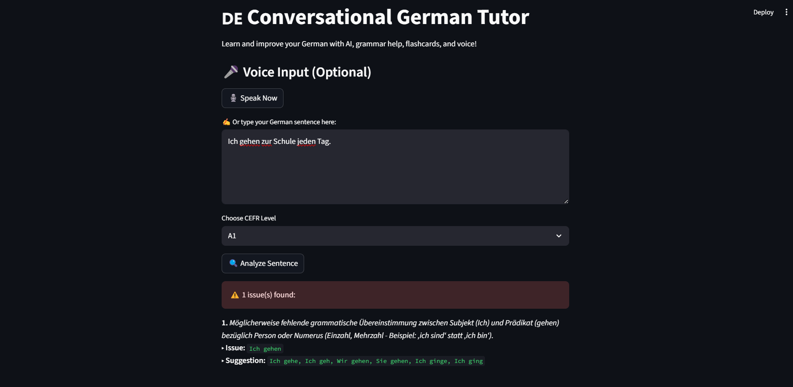
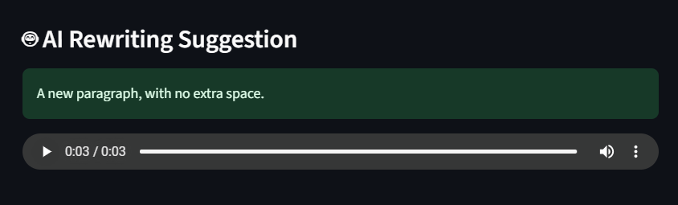
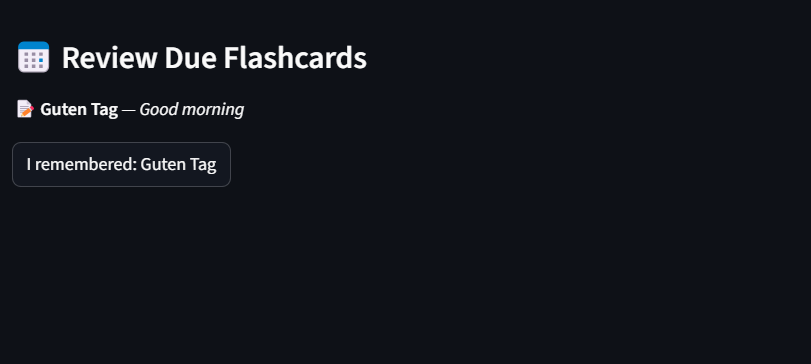

# 🇩🇪 Conversational German AI Tutor

An **AI-powered German learning assistant** that helps you:
- ✅ Check grammar using LanguageTool
- 🤖 Rewrite sentences politely with GPT-Neo
- 🎙️ Speak your input instead of typing
- 🔈 Hear improved sentences with gTTS voice
- 📖 Memorize vocabulary with Spaced Repetition (SM-2)

---


---

## 🖼️ Screenshots

### ✍️ Grammar Correction


### 🤖 AI Rewrite


### 📖 Flashcard Review (Spaced Repetition)


---

## 🧠 Features

| Feature             | Description |
|---------------------|-------------|
| ✅ Grammar Check     | Uses LanguageTool (de-DE) to spot grammar issues |
| 🤖 Sentence Rewriting | GPT-Neo 125M suggests polite improvements |
| 🎙️ Voice Input       | Speak instead of typing (SpeechRecognition) |
| 🔈 Voice Output      | Hears AI-rewritten sentence (gTTS) |
| 📖 Flashcards        | Save words and review using spaced repetition logic |
| 💾 Persistent DB     | Flashcards stored using SQLite |

---

## 🚀 Getting Started

### 📦 Clone & Install

```bash
git clone https://github.com/Karthiksriram09/german-ai-tutor.git
cd german-ai-tutor
python -m venv venv
venv\Scripts\activate     # On Windows
pip install -r requirements.txt
````

### ▶️ Run the App

```bash
streamlit run app.py
```

---

## 📂 Project Structure

```bash
german-ai-tutor/
├── app.py               # Main Streamlit app
├── flashcards.db        # SQLite DB (auto-created)
├── requirements.txt     # Dependencies
├── .gitignore           # Clean repo tracking
├── README.md            # You're here!
└── screenshots/         # Add preview images here
```

---

## 📽️ Demo Video (Coming Soon)

🎬 I’m recording a walkthrough demo soon. Stay tuned!

> [Subscribe here for updates →](https://www.youtube.com/@yourchannel)

---

## 🛡️ License

This project is licensed under the **MIT License** — see [`LICENSE`](LICENSE) file for details.

---

## 🙋‍♂️ Author

**Kudali Karthik Sriram**
📧 [karthiksriram009@gmail.com](mailto:karthiksriram009@gmail.com)
🌐 [GitHub](https://github.com/Karthiksriram09) • [LinkedIn](https://www.linkedin.com/in/kudalikarthiksriram/)

---

> Made with ❤️ using Python, AI, and determination.
